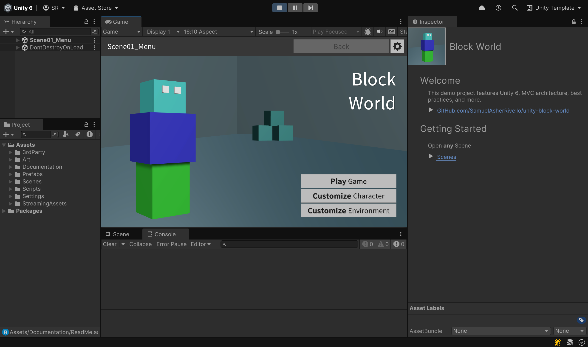
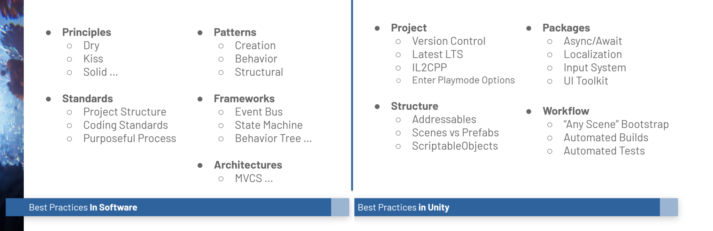

# Unity Block World 

### This demo project features Unity 6, MVC architecture, best practices, and more.

 

 
 

## Table of Contents

1. [Getting Started](#getting-started)
1. [Overview](#overview)
1. [Credits](#credits)

 
 

## Getting Started

### Play the demo

Here you can play an existing build.

| Platform      | Link | Known Issues                                                            |
|---------------|------|-------------------------------------------------------------------------|
| WebGPU        | [/Unity/Demo/WebGPUBuild/index.html](https://samuelasherrivello.github.io/unity-block-world/Unity/Demo/WebGPUBuild/index.html) | Shadows are low quality. Data changes (e.g., player color) do not save to disk |
| Windows 11    | [/Unity/Demo/WindowsBuild.zip](https://samuelasherrivello.github.io/unity-block-world/Unity/Demo/WindowsBuild.zip) | None                                                       
| Unity Editor  | (See Below) | None                                                                    |

### Build the demo

Here you can build the project yourself.

1. Download this repo (*.zip or *.git)
1. Download the [Unity Editor](https://store.unity.com/#plans-individual)
1. Open the `/Unity/` in the Unity Editor
1. Enjoy

 
 

## Overview

### Features

#### Best Practices

 

The project embraces many **software** best practices and **Unity-specific** best practices.

 
 

### Packages

#### Unity Packages

| Name                                                                                             | Description                                               |
|-------------------------------------------------------------------------------------------------|------------------------------------------------------------|
| [Assembly Definitions](https://docs.unity3d.com/Manual/ScriptCompilationAssemblyDefinitionFiles.html) | Organize and optimize script compilation.            |     
| [Best Practices: Coding Standards](https://www.samuelasherrivello.com/best-practices)            | Guidelines for consistent code style and format.          |
| [Best Practices: Project Structure](https://www.samuelasherrivello.com/best-practices)           | Recommended project structure and organization.           |    
| [Input System](https://docs.unity3d.com/Packages/com.unity.inputsystem@latest/)                  | Allows user control, using a device, touch, or gestures.              |
| [Rendering: Post-Processing](https://docs.unity3d.com/Packages/com.unity.postprocessing@latest)  | Visual effects like color grading and bloom.              |
| [Rendering: URP](https://docs.unity3d.com/Packages/com.unity.render-pipelines.universal@latest)  | Efficient rendering pipeline for various platforms.       |
| [Text Mesh Pro](https://docs.unity3d.com/Packages/com.unity.textmeshpro@latest)                  | High-quality text rendering and formatting.               |
| [UI Toolkit](https://docs.unity3d.com/Manual/UIElements.html)                | Latest and greatest UI based on web standards.                |
| [Unit Testing](https://docs.unity3d.com/Packages/com.unity.test-framework@latest)                | Automated tests to verify code stability.                 |
| [Unit Testing: Code Coverage](https://docs.unity3d.com/Packages/com.unity.test-framework.codecoverage@latest) | Measure code tested during unit testing.     |            

#### 3rd Party Packages

| Name                                                                                             | Description                                               |
|-------------------------------------------------------------------------------------------------|------------------------------------------------------------|
| [RMC Mini MVCS](https://www.npmjs.com/package/com.rmc.rmc-mini-mvcs) | MVC architecture framework for Unity games.         |     
| [RMC ReadMe ](https://www.npmjs.com/package/com.rmc.rmc-readme) | Display a custom ReadMe for the Unity Inspector Window.  |            

 
 

### Structure

**Documentation**
* `ReadMe.md` - The primary documentation for this repo
* `/Unity/Assets/Documentation/ReadMe.asset` - Select this asset in Unity to get started

**Configuration**
* `Unity Target` - [Standalone MAC/PC](https://support.unity.com/hc/en-us/articles/206336795-What-platforms-are-supported-by-Unity-)
* `Unity Version` - Use this [Version](./Unity/ProjectSettings/ProjectVersion.txt)
* `Unity Rendering` - [Universal Render Pipeline (URP)](https://docs.unity3d.com/Manual/universal-render-pipeline.html)
* `Unity Aspect Ratio` - [Game View 10x16](https://docs.unity3d.com/Manual/GameView.html)

**Structure**
* `/Unity/` - Open this folder in the Unity Editor
* `/Unity/Assets/Scenes/` - Open any Scene. Press 'Play'!

**Dependencies**
* `Various` - Already included via [Unity Package Manager](https://docs.unity3d.com/Manual/upm-ui.html) as this [Version](./Unity/Packages/manifest.json)

 
 

## Credits

**Created By**

- Samuel Asher Rivello
- Over 25 years XP with game development (2024)
- Over 11 years XP with Unity (2024)

**Contact**

- Twitter - <a href="https://twitter.com/srivello/">@srivello</a>
- Git - <a href="https://github.com/SamuelAsherRivello/">Github.com/SamuelAsherRivello</a>
- Resume & Portfolio - <a href="http://www.SamuelAsherRivello.com">SamuelAsherRivello.com</a>
- LinkedIn - <a href="https://Linkedin.com/in/SamuelAsherRivello">Linkedin.com/in/SamuelAsherRivello</a> <--- Say Hello! :)

**License**

Provided as-is under <a href="./LICENSE">MIT License</a> | Copyright ™ & © 2006 - 2024 Rivello Multimedia Consulting, LLC
